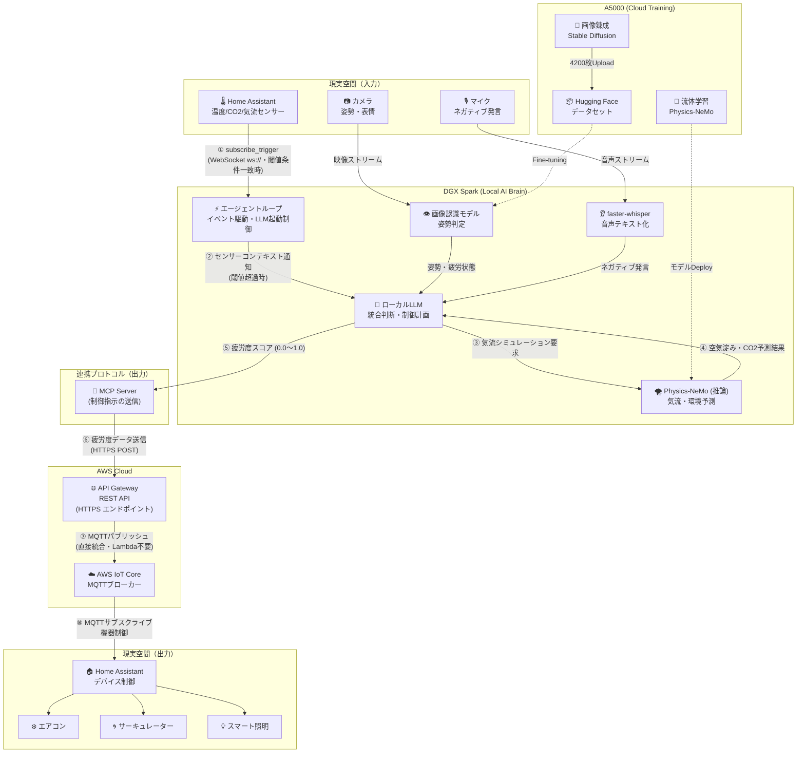

# kanden-ai-hackathon
**Kanden hackathon team NANIWA-Factory**

本プロジェクトは、エンジニアの「身体的・精神的な疲労」と「室内の物理的な環境」をマルチモーダルAIでリアルタイムに解析し、最適な作業空間を自動制御する **「空間AIブレイン」** です。

単なる「室温が上がったらエアコンをつける」というルールベースの制御ではなく、以下の高度な処理をローカル環境（DGX Spark）とクラウドGPU（A5000）のハイブリッド構成で実現します。

- **マルチモーダル疲労検知**: カメラ（姿勢崩れ）とマイク（「疲れた」「分らん！」などのネガティブ発言）からエンジニアのストレスを検知
- **AI流体シミュレーション (Physics-ML)**: CO2の滞留や空気の流れ（気流）をAIが物理演算に基づき予測
- **自律的空間制御**: LLMが状況を総合的に判断し、[Home Assistant](https://www.home-assistant.io/) を通じてエアコン、サーキュレーター、照明などを最適な状態へ自動制御

---

## 🛠️ 技術要素

本システムは、最先端のオープンソース技術と強力なGPUコンピューティングを組み合わせて構築されています。

| 技術 | ライブラリ / フレームワーク | 用途 |
|------|--------------------------|------|
| 音声認識 (ASR) | [faster-whisper](https://github.com/SYSTRAN/faster-whisper) | マイクからの音声をリアルタイム（超低遅延）でテキスト化し、ネガティブワードを抽出 |
| 物理情報NN (PINNs) | [Physics-NeMo](https://github.com/NVIDIA/physicsnemo) | 室内気流・CO2滞留のAIシミュレーション（CFD）モデルを構築 |
| 画像生成・姿勢推定 | Stable Diffusion + ControlNet | データ不足を補うため、エンジニアの疲労姿勢を再現した合成データセットを錬成 |
| スマートホーム連携 | [Home Assistant](https://www.home-assistant.io/) + MCP | センサーデータの取得と家電制御をLLMからMCP経由でシームレスかつセキュアに実行 |

### ハードウェア構成

| 役割 | 環境 |
|------|------|
| 推論 (Local) | DGX Spark（リアルタイム処理・LLM推論） |
| 学習・錬成 (Cloud) | NVIDIA RTX A5000（合成データの生成、Physics-NeMoの学習） |

---

## 📊 学習データ

AIの精度を高めるため、A5000の圧倒的な計算力を活かして独自のデータセットを構築しました。

### エンジニア姿勢合成データセット: [SeiyaCM/KandenAiHackathon](https://huggingface.co/datasets/SeiyaCM/KandenAiHackathon)

現場エンジニアの様々な姿勢（集中、頭を抱える等）をControlNet (Depth) を用いて100バリエーションずつ生成した、計4,200枚の高品質な画像データセット。

### 空間気流・環境データセット *(構築中)*

[Physics-NeMo](https://github.com/NVIDIA/physicsnemo) を用いて生成された「温度・CO2濃度・気流」の相関関係を示す物理シミュレーションデータ。

---

## 🏗️ システムアーキテクチャ

ローカルの最強推論環境（DGX Spark）を中心に、クラウド（A5000）で学習した知能をデプロイし、AWS API Gateway / IoT Core を中継レイヤーとして Home Assistant を制御するアーキテクチャです。

