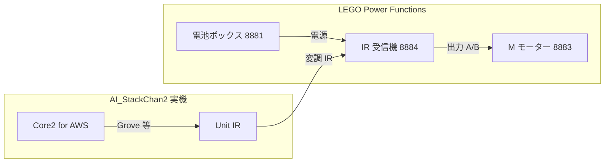
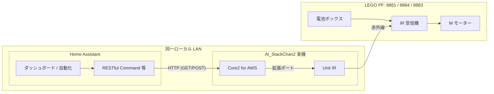

# Home Assistant から Stack-chan を制御するアーキテクチャ

本構成では **AI_StackChan2**（**M5Stack Core2 for AWS** + **Unit IR**、Arduino / PlatformIO）を利用する。書き込むファームウェアは **[niizawat/AI_StackChan2](https://github.com/niizawat/AI_StackChan2) の [`feat/monologue-ha-fatigue`](https://github.com/niizawat/AI_StackChan2/tree/feat/monologue-ha-fatigue)** ブランチとする（詳細は次節）。

## 目的と前提

- **目的**: Home Assistant（以下 HA）から **AI_StackChan2**（上記ハードウェア＋ファームウェア）の表情・発話・会話をトリガーする。
- **ハードウェア（本デモ想定）**: **M5Stack Core2 for AWS** と **Unit IR** の組み合わせとする。詳細は次節および [Unit IR](https://docs.m5stack.com/ja/unit/ir)・[Core2 for AWS](https://docs.m5stack.com/ja/core/core2_for_aws) の公式ドキュメントを参照する。
- **ネットワーク想定**: **HA と AI_StackChan2 は同一ローカル LAN 上**で動作する。HA から **mDNS ホスト名**（例: **`http://stack-chan.local`**）またはプライベート IP へ直接 HTTP する構成を前提とする。
- **Home Assistant 用 Raspberry Pi の mDNS 名**: Pi が LAN で応答する **`ホスト名.local`**（mDNS）は、**OS イメージのセットアップ時**（Raspberry Pi Imager の OS カスタマイズで「ホスト名」を指定する等）に決めた**マシン名**に一致する。文書中の **`rp5.local`** などは一例であり、環境ごとに異なる。SSH やブラウザで使う前に、実機の `hostname`（例: `hostnamectl`）や DHCP クライアント一覧で確認すること。
- **デバイス前提**: Core2 上のファームウェアが ESP32WebServer（ポート 80）で HTTP API を提供する。制御の接点は **LAN 内 HTTP API** とする。

## スタックちゃん側ハードウェア（本デモ想定）

| 役割 | 製品（M5Stack 公式） |
| --- | --- |
| メインコントローラ（表示・音声・Wi‑Fi・HTTP サーバ） | [Core2 for AWS](https://docs.m5stack.com/ja/core/core2_for_aws) |
| LEGO PF 向け赤外線送信（940nm、38kHz 変調、Grove HY2.0） | [Unit IR](https://docs.m5stack.com/ja/unit/ir) |

Unit IR は送信専用ではなく受信も備えるが、本デモの **`POST /lego`** 経路では**送信側**を LEGO **IR 受信機 8884** に向ける。接続ピン・ポート番号はファームウェア（例: Port B の GPIO 割当）と [Unit IR のピンマップ](https://docs.m5stack.com/ja/unit/ir)を照合する。

## 使用ファームウェア（本デモ）

| 項目 | 内容 |
| --- | --- |
| 取得元 | [niizawat/AI_StackChan2 — `feat/monologue-ha-fatigue`](https://github.com/niizawat/AI_StackChan2/tree/feat/monologue-ha-fatigue) |
| 上流 | [robo8080/AI_StackChan2](https://github.com/robo8080/AI_StackChan2) のフォーク |
| 本デモで前提とする拡張 | **LEGO Power Functions**（HTTP **`POST /lego`** による IR 送信）、**Home Assistant 連携**（同一 LAN の疲労センサ等を参照し独り言の口調を変える等。当該 README の「Home Assistant 連携」参照） |
| ビルド | リポジトリ内 **`M5Unified_AI_StackChan`** を PlatformIO で **Core2 for AWS** 向けにビルド・書き込み |

Wi‑Fi・API キー・話者番号など**共通の使い方**は、上流の [AI_StackChan2_README](https://github.com/robo8080/AI_StackChan2_README) を参照する。挙動の差分は当該ブランチの README・ソースを正とする。

## AI_StackChan2 側の制御面（入力）

AI_StackChan2 が提供する HTTP エンドポイント（**ポート 80**）。多くは **GET** だが、LEGO Power Functions 用の **`/lego`** は **POST**（`application/x-www-form-urlencoded`、Core2/CoreS3 向けビルド）である。ベース URL の例: **`http://stack-chan.local`**（mDNS。環境により `http://stack-chan.local/` のみ解決する場合あり）。

- **`/chat`** — 会話。例: `http://stack-chan.local/chat?text=こんにちは`。話者を変える場合: `.../chat?voice=4&text=こんにちは`（`voice` は 0〜60、[README の話者番号一覧](https://github.com/robo8080/AI_StackChan2_README)参照）
- **`/speech`** — TTS のみ発話。例: `http://stack-chan.local/speech?say=...&voice=...`
- **`/face`** — 表情のみ。例: `http://stack-chan.local/face?expression=1`
- **`/lego`** — LEGO PF 赤外線送信。**POST** のみ。例: `ch=0&pwm=7&out=b`（青側・PWM ニブル 7）、停止は `pwm=0`（詳細はファームウェアの `GET /lego` ヘルプ）
- **`/setting`** — 既定話者・音量。例: `.../setting?speaker=1`（0〜60）、`.../setting?volume=180`（0〜255）
- **`/role`** — ブラウザで ChatGPT のロール（キャラ設定）を入力・保存（POST）。空送信で削除
- **`/role_get`** — 現在のロールを取得

**本リポジトリ向けファーム改修（計画: `docs/plans/2026-03-23-feat-stackchan-handleclient-during-playback-plan.md`）:** TTS／MP3 **再生中も HTTP を処理**するため、長い発話のあいだでも **`POST /lego` 等が到達**しやすい。再生中に **`GET /speech` を再度呼ぶと HTTP 503**（本文 `Service Unavailable: TTS playing`）で拒否する実装とする。上流の AI_StackChan2 標準ファームでは再生中に `handleClient` が回らず、発話完了まで次のリクエストが遅延しうる点に留意する。

※ 認証は AI_StackChan2 標準では未実装。同一 LAN 内利用でも、ゲスト VLAN 等からの到達を抑止するなど **セグメント設計**は推奨する。

## スタックちゃんから Home Assistant へ（疲労センサー・独り言）

疲労指標が HA に集約されている場合、**AI_StackChan2 改修版**は同一 LAN 上で **Home Assistant REST API**（例: `GET /api/states/sensor.kanden_fatigue`）を **Long-Lived Access Token** で呼び出し、独り言モードで `exec_chatGPT` に渡す文へ **口調用の定性プレフィックス**のみを付与する（数値はモデルに送らない）。これは上記の **HA → スタックちゃん** の制御向きとは **逆方向の参照**である。設定はデバイス Web の **`/apikey`** から行い、ベース URL は **`http://<HA IP>:8123`**（HTTP）を推奨する。仕様の詳細は計画書 `docs/plans/2026-03-23-feat-stackchan-monologue-ha-fatigue-plan.md` を参照する。

## 初回設定（[AI_StackChan2_README](https://github.com/robo8080/AI_StackChan2_README) より）

デモ再現・運用で最低限そろえる項目は次のとおりである。**OpenAI / Web 版 VOICEVOX の API キー**、**STT 用キー**（利用する STT に応じる）、および **OpenAI チャット用のロール（システムプロンプト相当）** を含める。

### Wi‑Fi

microSD ルートに次を置くと初回設定しやすい（動作確認後は **SD を抜く**ことが README で推奨されている）。

- **`wifi.txt`** — 1行目: SSID、2行目: パスワード

### OpenAI API キー・Web 版 VOICEVOX API キー・STT 用キー

- **`apikey.txt`**（microSD ルート）  
  - **1行目**: **OpenAI API キー**（ChatGPT 系の会話・Whisper を OpenAI で使う場合に使用）  
  - **2行目**: **Web 版 VOICEVOX の API キー**（TTS。Web 版 VOICEVOX の発行手順はサービス側ドキュメント参照）  
  - **3行目**: **STT 用キー** — **OpenAI と同一キー**にすると **Whisper**、**Google Cloud STT 用キー**にすると **Google STT**（詳細は README）

既に Wi‑Fi へ接続済みの場合は、ブラウザで **`http://stack-chan.local/apikey`**（または表示 IP）の設定画面から、上記と同様の項目（OpenAI・VOICEVOX・STT 等）を入力・保存してもよい。

**M5Burner 等でファームを入れ直した場合**は、README のとおり **SD または `/apikey` から API キーを再度設定**すること。

### OpenAI 用ロール（システムプロンプト相当）

会話のキャラクター・禁止事項・口調など、**ChatGPT に渡すロール**（実装上はシステムプロンプトに相当する設定）を登録する。

- **ホスト名**: スタックちゃん本体への HTTP は **`http://stack-chan.local`**（mDNS）を正とする。Raspberry Pi 上の Home Assistant など別機器のホスト名（例: **`rp5.local`**）と**取り違えない**こと。
- **推奨**: ブラウザで **`http://stack-chan.local/role`**（またはスタックちゃんの表示 IP）を開き、テキストを入力して保存（**POST**。空送信で削除）。**`GET http://stack-chan.local/role_get`** で現在値を確認できる（応答は HTML 内の `<pre>` に JSON が入る形式）。
- HTTP 仕様の一覧は上記「**`/role`**」「**`/role_get`**」を参照。

**デモ再現用の文面例**は、実機で `role_get` を確認したうえで `docs/stackchan_role_reference.md` に転記・更新する（チーム内共有用）。

HA 連携で独り言の口調を変える改修（`feat/monologue-ha-fatigue` 等）を併用する場合でも、**ベースとなるロール**は `/role` で設定し、疲労センサに応じた**追補の口調プレフィックス**がファーム側で付与される（詳細は `docs/plans/2026-03-23-feat-stackchan-monologue-ha-fatigue-plan.md`）。

### 本体操作の補足（HA 連携外だが運用で有用）

- **Core2 ウェイクワード**: ボタン B を約2秒長押しで登録音声を録音 → ボタン A でウェイクワード有効（電源投入直後は無効）
- 額付近タッチでマイク録音（約7秒）、左端中央タッチで独り言モード、中央タッチで首振り停止、ボタン C で TTS テスト 等（詳細は README）

## アプローチの比較

### A: HA から直接 REST（推奨・最小構成）

HA の **RESTful Command**、**Shell Command**、または **Template** から上記 URL を呼び出す。

- **利点**: 追加サーバ不要、構成が単純、遅延が小さい。
- **欠点**: 主に GET だが POST も混在する。認証が無い場合はセキュリティ設計が別途必要。

### B: MQTT ブリッジ（中継サービス）

別プロセス（例: Node-RED、Python、小型コンテナ。**同一 LAN 上のマシン**で可）が MQTT を購読し、AI_StackChan2 へ HTTP を転送する。

- **利点**: HA の MQTT 連携と統一できる。複数 Stack-chan への振り分けがしやすい。
- **欠点**: 運用コンポーネントが増える。

### C: ESPHome デバイス経由の HTTP リクエスト

別 ESP で `http_request` 等から Stack-chan IP へ GET を送る。

- **利点**: 「物理ボタン → ESPHome → Stack-chan」のようなローカル連鎖に使える。
- **欠点**: HA から AI_StackChan2 を制御する主経路としては冗長。通常は A または B で十分。

## リポジトリの HA パッケージ（疲労度）

本リポジトリの `homeassistant/package_stackchan_fatigue.yaml` を `configuration.yaml` の `packages` から読み込むと、**`sensor.kanden_fatigue`** に連動する次の自動化が利用できる。

- **0.7 未満**: `GET /face?expression=0` で表情を Neutral に戻す。
- **0.7 以上**: 固定文言の `GET /speech`（`curl --data-urlencode`）の後、`POST /lego` で `ch=0`・青側（`out=b`）を **`pwm=7`** で駆動し、**15 秒**の `delay` のあと `pwm=0` で停止。再入防止のため **`mode: single`**。

詳細は計画書 `docs/plans/2026-03-23-feat-ha-fatigue-stackchan-high-threshold-plan.md` を参照する。

## LEGO Power Functions 物理構成（本デモ想定）

疲労度連動の **`POST /lego`** は、スタックちゃん本体の**赤外線送信**を経由して **LEGO Power Functions** の **IR 受信機**へコマンドを届ける。本リポジトリのデモでは、次の**3 点セット**を前提とする。

| 役割 | 製品（LEGO 公式） |
| --- | --- |
| IR 受信・チャンネル A/B 出力 | [LEGO Power Functions IR Receiver 8884](https://www.lego.com/en-us/product/lego-power-functions-ir-receiver-8884) |
| 負荷（モーター） | [LEGO Power Functions M Motor 8883](https://www.lego.com/en-us/product/lego-power-functions-m-motor-8883) |
| 電源 | [LEGO Power Functions Battery Box 8881](https://www.lego.com/en-us/product/lego-power-functions-battery-box-8881) |

**配線の考え方**: 電池ボックスから IR 受信機へ電源を供給し、**M モーターを IR 受信機の出力端子**（チャンネル **A** または **B**。本パッケージの例では **`out=b`** で**青側**）に接続する。**Unit IR** の送信部と LEGO **IR 受信機 8884** のセンサが**視界内**になるよう配置する。

## 推奨アーキテクチャ（論理・LEGO 含む）

## セキュリティ・運用上の注意（同一 LAN 想定）

- AI_StackChan2 の HTTP サービスを **WAN から到達可能にしない**（ルータのポート開放を避ける）。
- 同一 LAN 内のみで足りるため、**VPN 経由の到達**は必須ではない。リモートから HA を経由して AI_StackChan2 を触る場合は、HA のリモートアクセス経路の保護が間接的にデバイスも守る。
- **mDNS**（例: `stack-chan.local`）で呼ぶと DHCP で IP が変わっても HA の設定を変えずに済むことが多い。解決しないクライアントでは **IP 固定（DHCP 予約）** を併用する。

## 次のステップ（実装時）

1. **[niizawat/AI_StackChan2 `feat/monologue-ha-fatigue`](https://github.com/niizawat/AI_StackChan2/tree/feat/monologue-ha-fatigue)** を取得し、**Core2 for AWS** に **Unit IR** を接続したうえでビルド・書き込みする。**`http://stack-chan.local/`** 等で `/chat`・`/speech`・`/face` を手動で疎通確認する（`/lego` は IR 経路込みで確認）。
2. HA に RESTful Command（または同等）を定義し、ダッシュボードボタン・自動化から呼び出す。
3. 要件が MQTT 統一のみの場合は B のブリッジを検討する。

## ドキュメント用アセット（`docs/assets`）

本アーキテクチャや疲労度連携の**説明・デモ用**に同梱するファイルである。リポジトリ内の相対パスはいずれも `docs/assets/` 配下。

| ファイル | 形式 | 内容の概要 |
| --- | --- | --- |
| `homeassistant_screenshot_activity.png` | PNG | Home Assistant の**アクティビティ（ログブック）**画面のスクリーンショット。`sensor.kanden_fatigue`（疲労度）の閾値 **0.7** を境に、**高閾値時の発話・LEGO 駆動**および**低閾値時の表情リセット**の自動化が発火した記録を示す。`package_stackchan_fatigue.yaml` 等の挙動を第三者へ説明する際の根拠画像として用いる。 |
| `homeassistant_screenshot_history.png` | PNG | **疲労度ダッシュボード**上の**履歴**カードのスクリーンショット。疲労度エンティティの時系列（例: 値 **0.8** の区間）を可視化しており、センサ値の変動と自動化タイミングの関係を説明する際に参照する。 |
| `stackchan_demo.mov` | QuickTime 動画（`.mov`） | **AI_StackChan2（スタックちゃん）**側の実機デモ記録。疲労度連動の発話・表情・LEGO 等の**エンドツーエンドの見せ方**を動画で示す用途を想定する。ファイルサイズが大きいため、Git 管理や配布方針はチームの運用に合わせて決めること。 |

## 参考

- [`docs/stackchan_role_reference.md`](stackchan_role_reference.md)（`/role` の system 文面・`stack-chan.local` での確認手順）
- [M5Stack Core2 for AWS（製品ドキュメント）](https://docs.m5stack.com/ja/core/core2_for_aws)
- [M5Stack Unit IR（製品ドキュメント）](https://docs.m5stack.com/ja/unit/ir)
- [niizawat/AI_StackChan2 — `feat/monologue-ha-fatigue`（本デモで使用するファームウェア）](https://github.com/niizawat/AI_StackChan2/tree/feat/monologue-ha-fatigue)
- [robo8080/AI_StackChan2（上流ファームウェア）](https://github.com/robo8080/AI_StackChan2)
- [AI_StackChan2_README（上流・共通の使い方）](https://github.com/robo8080/AI_StackChan2_README)（Wi‑Fi・API キー・HTTP API・ウェイクワード・話者番号一覧など）
