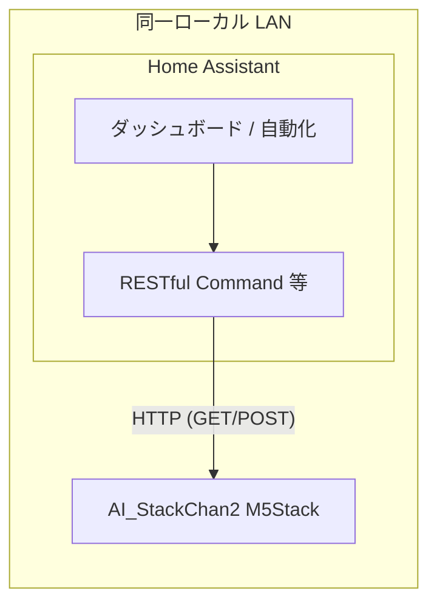

# Home Assistant から Stack-chan を制御するアーキテクチャ

本構成では **AI_StackChan2**（Arduino / PlatformIO 版スタックちゃん）を利用する。

## 目的と前提

- **目的**: Home Assistant（以下 HA）から **AI_StackChan2**（M5Stack + Arduino ファームウェア）の表情・発話・会話をトリガーする。
- **ネットワーク想定**: **HA と AI_StackChan2 は同一ローカル LAN 上**で動作する。HA から **mDNS ホスト名**（例: **`http://stack-chan.local`**）またはプライベート IP へ直接 HTTP する構成を前提とする。
- **デバイス前提**: AI_StackChan2 は ESP32WebServer（ポート 80）で HTTP API を提供する。制御の接点は **LAN 内 HTTP API** とする。

## AI_StackChan2 側の制御面（入力）

AI_StackChan2 が提供する HTTP エンドポイント（**ポート 80**）。多くは **GET** だが、LEGO Power Functions 用の **`/lego`** は **POST**（`application/x-www-form-urlencoded`、Core2/CoreS3 向けビルド）である。ベース URL の例: **`http://stack-chan.local`**（mDNS。環境により `http://stack-chan.local/` のみ解決する場合あり）。

- **`/chat`** — 会話。例: `http://stack-chan.local/chat?text=こんにちは`。話者を変える場合: `.../chat?voice=4&text=こんにちは`（`voice` は 0〜60、[README の話者番号一覧](https://github.com/robo8080/AI_StackChan2_README)参照）
- **`/speech`** — TTS のみ発話。例: `http://stack-chan.local/speech?say=...&voice=...`
- **`/face`** — 表情のみ。例: `http://stack-chan.local/face?expression=1`
- **`/lego`** — LEGO PF 赤外線送信。**POST** のみ。例: `ch=0&pwm=7&out=b`（青側・PWM ニブル 7）、停止は `pwm=0`（詳細はファームウェアの `GET /lego` ヘルプ）
- **`/setting`** — 既定話者・音量。例: `.../setting?speaker=1`（0〜60）、`.../setting?volume=180`（0〜255）
- **`/role`** — ブラウザで ChatGPT のロール（キャラ設定）を入力・保存（POST）。空送信で削除
- **`/role_get`** — 現在のロールを取得

**本リポジトリ向けファーム改修（計画: `docs/plans/2026-03-23-feat-stackchan-handleclient-during-playback-plan.md`）:** TTS／MP3 **再生中も HTTP を処理**するため、長い発話のあいだでも **`POST /lego` 等が到達**しやすい。再生中に **`GET /speech` を再度呼ぶと HTTP 503**（本文 `Service Unavailable: TTS playing`）で拒否する実装とする。上流の AI_StackChan2 標準ファームでは再生中に `handleClient` が回らず、発話完了まで次のリクエストが遅延しうる点に留意する。

※ 認証は AI_StackChan2 標準では未実装。同一 LAN 内利用でも、ゲスト VLAN 等からの到達を抑止するなど **セグメント設計**は推奨する。

## スタックちゃんから Home Assistant へ（疲労センサー・独り言）

疲労指標が HA に集約されている場合、**AI_StackChan2 改修版**は同一 LAN 上で **Home Assistant REST API**（例: `GET /api/states/sensor.kanden_fatigue`）を **Long-Lived Access Token** で呼び出し、独り言モードで `exec_chatGPT` に渡す文へ **口調用の定性プレフィックス**のみを付与する（数値はモデルに送らない）。これは上記の **HA → スタックちゃん** の制御向きとは **逆方向の参照**である。設定はデバイス Web の **`/apikey`** から行い、ベース URL は **`http://<HA IP>:8123`**（HTTP）を推奨する。仕様の詳細は計画書 `docs/plans/2026-03-23-feat-stackchan-monologue-ha-fatigue-plan.md` を参照する。

## 初回設定（[AI_StackChan2_README](https://github.com/robo8080/AI_StackChan2_README) より）

microSD ルートに次を置くと初回設定しやすい（動作確認後は **SD を抜く**ことが README で推奨されている）。

- **`wifi.txt`** — 1行目: SSID、2行目: パスワード
- **`apikey.txt`** — 1行目: OpenAI API キー、2行目: Web 版 VOICEVOX API キー、3行目: STT 用キー  
  - 3行目を **OpenAI と同じキー**にすると **Whisper**、**Google Cloud STT キー**にすると **Google STT**

既に Wi‑Fi へ接続済みの場合は、ブラウザで **`http://stack-chan.local/apikey`**（または表示 IP）から API キー設定も可能。

**M5Burner 等でファームを入れ直した場合**は、README のとおり **SD から API キーを再度設定**すること。

### 本体操作の補足（HA 連携外だが運用で有用）

- **Core2 ウェイクワード**: ボタン B を約2秒長押しで登録音声を録音 → ボタン A でウェイクワード有効（電源投入直後は無効）
- 額付近タッチでマイク録音（約7秒）、左端中央タッチで独り言モード、中央タッチで首振り停止、ボタン C で TTS テスト 等（詳細は README）

## アプローチの比較

### A: HA から直接 REST（推奨・最小構成）

HA の **RESTful Command**、**Shell Command**、または **Template** から上記 URL を呼び出す。

- **利点**: 追加サーバ不要、構成が単純、遅延が小さい。
- **欠点**: 主に GET だが POST も混在する。認証が無い場合はセキュリティ設計が別途必要。

### B: MQTT ブリッジ（中継サービス）

別プロセス（例: Node-RED、Python、小型コンテナ。**同一 LAN 上のマシン**で可）が MQTT を購読し、AI_StackChan2 へ HTTP を転送する。

- **利点**: HA の MQTT 連携と統一できる。複数 Stack-chan への振り分けがしやすい。
- **欠点**: 運用コンポーネントが増える。

### C: ESPHome デバイス経由の HTTP リクエスト

別 ESP で `http_request` 等から Stack-chan IP へ GET を送る。

- **利点**: 「物理ボタン → ESPHome → Stack-chan」のようなローカル連鎖に使える。
- **欠点**: HA から AI_StackChan2 を制御する主経路としては冗長。通常は A または B で十分。

## リポジトリの HA パッケージ（疲労度）

本リポジトリの `homeassistant/package_stackchan_fatigue.yaml` を `configuration.yaml` の `packages` から読み込むと、**`sensor.kanden_fatigue`** に連動する次の自動化が利用できる。

- **0.7 未満**: `GET /face?expression=0` で表情を Neutral に戻す。
- **0.7 以上**: 固定文言の `GET /speech`（`curl --data-urlencode`）の後、`POST /lego` で `ch=0`・青側（`out=b`）を **`pwm=7`** で駆動し、**15 秒**の `delay` のあと `pwm=0` で停止。再入防止のため **`mode: single`**。

詳細は計画書 `docs/plans/2026-03-23-feat-ha-fatigue-stackchan-high-threshold-plan.md` を参照する。

## 推奨アーキテクチャ（論理）

## セキュリティ・運用上の注意（同一 LAN 想定）

- AI_StackChan2 の HTTP サービスを **WAN から到達可能にしない**（ルータのポート開放を避ける）。
- 同一 LAN 内のみで足りるため、**VPN 経由の到達**は必須ではない。リモートから HA を経由して AI_StackChan2 を触る場合は、HA のリモートアクセス経路の保護が間接的にデバイスも守る。
- **mDNS**（例: `stack-chan.local`）で呼ぶと DHCP で IP が変わっても HA の設定を変えずに済むことが多い。解決しないクライアントでは **IP 固定（DHCP 予約）** を併用する。

## 次のステップ（実装時）

1. M5Stack Core2 に **AI_StackChan2** を書き込み、**`http://stack-chan.local/`** 等で `/chat`・`/speech`・`/face` を手動で疎通確認する。
2. HA に RESTful Command（または同等）を定義し、ダッシュボードボタン・自動化から呼び出す。
3. 要件が MQTT 統一のみの場合は B のブリッジを検討する。

## 参考

- [AI_StackChan2](https://github.com/robo8080/AI_StackChan2)（ファームウェア本体）
- [AI_StackChan2_README](https://github.com/robo8080/AI_StackChan2_README)（Wi‑Fi・API キー・HTTP API・ウェイクワード・話者番号一覧など公式の使い方）
