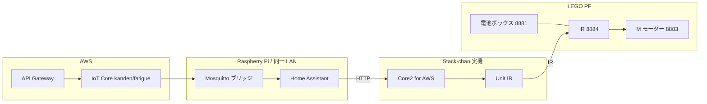

# エッジデモ実行ガイド（AWS・Home Assistant・Stack-chan）

**最終検証日:** （手順を通したら `YYYY-MM-DD` と検証済みコミットを記入）  
**想定所要:** 初回フル構築で半日〜1 日（環境・慣れにより変動）  
**オーナー:** （任意）

チーム内の**デモ再現担当**向け。クラウド経由の疲労スコア → Home Assistant → スタックちゃん（発話・表情・LEGO PF）までの**作業順**と**確認観点**を 1 本にまとめる。細部はリンク先のドキュメントを正とする。

## 目次

- [1. 目的・読者](#1-目的読者)
- [2. エンドツーエンド概要](#2-エンドツーエンド概要)
- [3. 前提条件](#3-前提条件)
- [4. AWS 側](#4-aws-側)
- [5. Raspberry Pi と Home Assistant](#5-raspberry-pi-と-home-assistant)
- [6. Stack-chan（AI_StackChan2）](#6-stack-chanai_stackchan2)
- [7. LEGO Power Functions（物理構成）](#7-lego-power-functions物理構成)
- [8. スモーク検証](#8-スモーク検証)
- [9. トラブルシュート（短表）](#9-トラブルシュート短表)
- [10. ロールバック・部分巻き戻し](#10-ロールバック部分巻き戻し)
- [11. 参考（リポジトリ内）](#11-参考リポジトリ内)

## 1. 目的・読者

- **目的:** 疲労デモのデータ経路（API → IoT → MQTT → HA センサー → 自動化 → Stack-chan）を**同じ順序で再現**する。
- **読者:** チーム内のみ（手順に API キー等を**書かない**。環境変数・`secrets.yaml`・パスワードマネージャを利用）。
  - （注）キーや Long-Lived Token は、リポジトリに限らずチャット・スクリーンショット・画面録画・シェル履歴にも残さないよう注意する。

## 2. エンドツーエンド概要

**データフロー:**  
`POST`（API Gateway）→ **AWS IoT Core** トピック `kanden/fatigue` → **Mosquitto**（Pi 上）ブリッジ → **Home Assistant** MQTT → センサー **`sensor.kanden_fatigue`** → **自動化**（閾値 0.7）→ **Stack-chan** `GET` / `POST` HTTP → **LEGO PF**（IR）。

詳細な論理図・LEGO 実機の Mermaid は [`architecture-home-assistant-stackchan.md`](architecture-home-assistant-stackchan.md) を参照。本節では**データと制御の流れ**のみ示す。



## 3. 前提条件

- **AWS アカウント**とデプロイ済み **`iac/`** スタック（後述）。**注意:** `cdk deploy` は対象アカウント・リージョン上でリソースの**作成・更新**が行われ、**課金**や既存構成への**変更**につながる。
- **Raspberry Pi**（または同等ホスト）に **Home Assistant** と **Mosquitto**、同一 LAN に **Stack-chan**。
- **ツール例:** `aws` CLI、`docker` / Docker Compose、`curl`、`python3`（スモークスクリプト）、Stack-chan ファーム用 **PlatformIO**（[VS Code 拡張](https://platformio.org/) 等）。
- **ホスト名:** Pi の **`ホスト名.local`**（mDNS）は **Raspberry Pi OS イメージ書き込み時に指定したホスト名**に一致する。文書中の `rp5.local` 等は一例。

**検証した組み合わせのメモ（推奨）:** 実際に通した **HA イメージタグ**・**CDK のリージョン**・コミット SHA を冒頭メタデータまたは PR に 1 行残す。

## 4. AWS 側

1. **CDK** でスタックをデプロイする。エントリはリポジトリの [`iac/README.md`](../iac/README.md) と `iac/bin` を参照（**既定のスタッククラス名は `IacStack`**。CloudFormation 上のスタック名は環境により異なる場合あり — `cdk ls` で確認）。
2. **POST 先 URL** を取得する（Output キー **`PostFatigueEndpoint`**。`iac/lib/iac-stack.ts` に定義）。

   ```bash
   aws cloudformation describe-stacks --stack-name IacStack --region "<REGION>" \
     --query "Stacks[0].Outputs[?OutputKey=='PostFatigueEndpoint'].OutputValue" --output text
   ```

3. **API キー**（リクエストヘッダー `x-api-key` に付ける値）を取得する。Output キー **`ApiKeyId`** は `iac/lib/iac-stack.ts` でスタック出力として定義されている。

   まずスタックから **API Key ID**（キーそのものではない）を取得する。

   ```bash
   aws cloudformation describe-stacks --stack-name IacStack --region "<REGION>" \
     --query "Stacks[0].Outputs[?OutputKey=='ApiKeyId'].OutputValue" --output text
   ```

   表示された ID を次の `<ApiKeyId>` に入れ、**キー値**を取得する。

   ```bash
   aws apigateway get-api-key --api-key "<ApiKeyId>" --include-value --region "<REGION>" \
     --query value --output text
   ```

   2 つ目のコマンドの標準出力が `x-api-key` に設定する文字列。取得後は画面共有・シェル履歴・ログに残さない。

**確認:** `curl` でスキーマに合った `POST` を送り、HTTP が **2xx** になること。キーはシェル履歴・ログに残さない。

## 5. Raspberry Pi と Home Assistant

詳細手順の**ソース・オブ・トゥルース**は [`homeassistant-mqtt-kanden-fatigue.md`](homeassistant-mqtt-kanden-fatigue.md)。ここでは**順序**と**リポジトリ内ファイル**のみ示す。

| リポジトリ内の参照 | 用途 |
| --- | --- |
| [`../homeassistant/docker-compose.yml`](../homeassistant/docker-compose.yml) | HA コンテナ起動例（`network_mode: host`、ボリュームは環境に合わせて変更） |
| [`../homeassistant/mosquitto_aws_iot_bridge.conf`](../homeassistant/mosquitto_aws_iot_bridge.conf) | Mosquitto ↔ AWS IoT ブリッジ設定の例 |
| [`../homeassistant/mqtt_kanden_fatigue.yaml`](../homeassistant/mqtt_kanden_fatigue.yaml) | `kanden/fatigue` からセンサー化する MQTT 設定例 |
| [`../homeassistant/package_stackchan_fatigue.yaml`](../homeassistant/package_stackchan_fatigue.yaml) | `sensor.kanden_fatigue` の自動化（閾値 0.7 と Stack-chan `curl`） |

**チェックリスト（要約）:**

1. IoT Thing・証明書・ポリシー → Mosquitto ブリッジ稼働（上記 doc）。
2. HA の `configuration.yaml` に **`packages:`** で `package_stackchan_fatigue.yaml` 等を読み込む。
3. **`mqtt_kanden_fatigue.yaml` の内容**が HA に取り込まれていること（同一ファイルを `packages` に含める、または同等の `mqtt` センサー定義があること）。
4. **Developer Tools → States** に **`sensor.kanden_fatigue`** が現れること。
5. 設定変更後は **Developer Tools → YAML → 再読み込み**、またはコンテナ／サービス再起動。

**注意（Docker）:** [`docker-compose.yml`](../homeassistant/docker-compose.yml) コメントのとおり、**コンテナ内の名前解決で `stack-chan.local` が効かない**場合がある。`package_stackchan_fatigue.yaml` の Stack-chan URL は **IP 直指定**や DHCP 予約と併用する（詳細は [`architecture-home-assistant-stackchan.md`](architecture-home-assistant-stackchan.md)）。

**確認:** MQTT Explorer 等で `kanden/fatigue` にメッセージが流れていること（任意）。

## 6. Stack-chan（AI_StackChan2）

一次情報は [`architecture-home-assistant-stackchan.md`](architecture-home-assistant-stackchan.md)。

**チェックリスト（要約）:**

1. **ハード:** **M5Stack Core2 for AWS** + **Unit IR**（公式: [Core2 for AWS](https://docs.m5stack.com/ja/core/core2_for_aws)、[Unit IR](https://docs.m5stack.com/ja/unit/ir)）。
2. **ファーム:** [niizawat/AI_StackChan2 の `feat/monologue-ha-fatigue`](https://github.com/niizawat/AI_StackChan2/tree/feat/monologue-ha-fatigue) の **`M5Unified_AI_StackChan`** を PlatformIO でビルドし、USB 経由で書き込む（詳細は下記「ファームのビルド・書き込み」）。
3. **同一 LAN** で `http://stack-chan.local`（または表示 IP）に到達すること。Pi の `*.local` とは**別ホスト**。
4. **API キー:** OpenAI・Web 版 VOICEVOX・STT 用（`apikey.txt` または `http://stack-chan.local/apikey`）。詳細はアーキテクチャ「初回設定」。
5. **`/role`（システムプロンプト相当）:** [`stackchan_role_reference.md`](stackchan_role_reference.md) の手順で実機と同期。確認は `GET http://stack-chan.local/role_get`。
6. **HA 独り言連携（任意）:** 疲労センサを参照する改修を使う場合、デバイスの `/apikey` に HA ベース URL・Long-Lived Token・エンティティ ID を設定（アーキテクチャ「スタックちゃんから Home Assistant へ」）。

### ファームのビルド・書き込み

チェックリスト 2 の補足。対象は [niizawat/AI_StackChan2 の `feat/monologue-ha-fatigue`](https://github.com/niizawat/AI_StackChan2/tree/feat/monologue-ha-fatigue) 内の **`M5Unified_AI_StackChan`** である。

1. **前提:** Visual Studio Code と [PlatformIO IDE 拡張](https://platformio.org/install/ide?install=vscode)、または [PlatformIO Core](https://docs.platformio.org/en/latest/core/installation.html)（CLI）を用意する。
2. **取得:** リポジトリをクローンし、`git checkout feat/monologue-ha-fatigue` する。
3. **プロジェクト:** クローン先の **`M5Unified_AI_StackChan`** を VS Code で開く（PlatformIO のプロジェクトルート）。`platformio.ini` の **`default_envs = m5stack-core2`** を用いる。**M5Stack Core2 for AWS** は本ファームでは **M5Stack Core2** 向け環境（`m5stack-core2`）でビルドする。
4. **書き込み:** Core2 for AWS を USB で接続し、VS Code の **PlatformIO: Upload** を実行する。CLI の場合は、上記ディレクトリをカレントにして次を実行する。

   ```bash
   pio run -e m5stack-core2 -t upload
   ```

   シリアルポートが複数ある場合は `pio device list` で確認し、`pio run -e m5stack-core2 -t upload --upload-port "<PORT>"` のように指定する。
5. **（任意）ログ:** **PlatformIO: Serial Monitor** または `pio device monitor`（`platformio.ini` の **`monitor_speed = 115200`** に合わせる）。

**確認:** ブラウザで `/chat` または `/speech` の簡易疎通、`GET /lego` ヘルプまたはドキュメント記載のとおり `POST /lego` のテスト（IR と LEGO 受信機の配置が必要）。

## 7. LEGO Power Functions（物理構成）

本デモ想定は次の **3 点セット**（Mermaid 図の LEGO PF ボックスと対応）。

| 役割 | 製品 | 製品ページ（LEGO.com・参照） |
| --- | --- | --- |
| 電源 | 電池ボックス **8881** | [LEGO Power Functions Battery Box 8881](https://www.lego.com/en-us/product/lego-power-functions-battery-box-8881) |
| IR 受信・チャンネル A/B 出力 | IR 受信機 **8884** | [LEGO Power Functions IR Receiver 8884](https://www.lego.com/en-us/product/lego-power-functions-ir-receiver-8884) |
| 負荷（モーター） | M モーター **8883** | [LEGO Power Functions M Motor 8883](https://www.lego.com/en-us/product/lego-power-functions-m-motor-8883) |

配線・視界・チャンネル指定の詳細は [`architecture-home-assistant-stackchan.md`](architecture-home-assistant-stackchan.md) の「LEGO Power Functions 物理構成（本デモ想定）」を参照（上記 URL は同表と同一）。

**確認:** 受信機のセンサが Unit IR の送信と**視界内**であること。パッケージ例では **`out=b`（青側）** 等 — YAML とファームの説明を一致させる。

## 8. スモーク検証

1. **環境変数**（値はチームの保管場所から設定し、**ターミナルに貼り付けたままスクショしない**）:

   ```bash
   export KANDEN_FATIGUE_API_URL='https://.../v1/fatigue'
   export KANDEN_FATIGUE_API_KEY='...'
   ```

2. リポジトリルートで:

   ```bash
   ./scripts/post-fatigue-apigw-ha-test.sh
   ```

3. **期待:** 1 回目 `fatigue_score=0.5` → HTTP 200、しばらくしてセンサーが **0.7 未満**側。2 回目 `0.8` → 200、**0.7 以上**の自動化が発火（発話・`POST /lego`・15 秒後停止など — [`package_stackchan_fatigue.yaml`](../homeassistant/package_stackchan_fatigue.yaml) 参照）。

4. **HA UI:** **アクティビティ**（ログブック）で該当自動化の実行、**疲労度**ダッシュボードの履歴でセンサー推移を確認。参考画像: [`docs/assets/homeassistant_screenshot_activity.png`](assets/homeassistant_screenshot_activity.png)、[`docs/assets/homeassistant_screenshot_history.png`](assets/homeassistant_screenshot_history.png)。

5. **実機:** Stack-chan の発話・表情・LEGO の動作を確認（参考動画: [`docs/assets/stackchan_demo.mov`](assets/stackchan_demo.mov)）。

## 9. トラブルシュート（短表）

| 症状 | 切り分け |
| --- | --- |
| `stack-chan.local` が解決しない | Pi / コンテナからは **IP 直指定**。ルータで DHCP 予約。 |
| センサーが更新されない | IoT ルール・Mosquitto ブリッジ・トピック名 `kanden/fatigue`・JSON パス `value_json.fatigue_score`（[`mqtt_kanden_fatigue.yaml`](../homeassistant/mqtt_kanden_fatigue.yaml) と整合）。 |
| `post-fatigue-apigw-ha-test.sh` が 403/401 | API キー・URL・リージョン。`aws` プロファイル（例: `awsume`）。 |
| 自動化が動かない | `sensor.kanden_fatigue` の実体 ID、パッケージ読み込み、YAML リロード、閾値（`above: 0.7` / `below: 0.7`）。 |
| LEGO のみ動かない | IR 方向・チャンネル A/B・`package_stackchan_fatigue.yaml` の `out` / `pwm`、Stack-chan ファームの `/lego`。 |

## 10. ロールバック・部分巻き戻し

- **自動化だけ止める:** Home Assistant の該当自動化をオフ、または一時的に `package` をコメントアウトして YAML 再読み込み。
- **MQTT ブリッジを止める:** Mosquitto / ブリッジ設定を無効化（詳細は [`homeassistant-mqtt-kanden-fatigue.md`](homeassistant-mqtt-kanden-fatigue.md)）。
- **API キーローテーション:** API Gateway 側でキー差し替え後、スモーク用環境変数とチーム保管庫を更新（古いキーをリポジトリに書かない）。

完全なインフラ削除手順は CDK / 運用ポリシーに従う。

## 11. 参考（リポジトリ内）

| ドキュメント | 内容 |
| --- | --- |
| [`architecture-home-assistant-stackchan.md`](architecture-home-assistant-stackchan.md) | Stack-chan API、ハード、ファーム、LEGO、セキュリティ注意 |
| [`homeassistant-mqtt-kanden-fatigue.md`](homeassistant-mqtt-kanden-fatigue.md) | MQTT・IoT・Mosquitto・HA センサー詳細 |
| [`stackchan_role_reference.md`](stackchan_role_reference.md) | `/role` 文面・`stack-chan.local` |
| [`brainstorms/2026-03-24-edge-demo-setup-documentation-brainstorm.md`](brainstorms/2026-03-24-edge-demo-setup-documentation-brainstorm.md) | 要件のブレインストーム |
| [`plans/2026-03-24-feat-edge-demo-setup-documentation-plan.md`](plans/2026-03-24-feat-edge-demo-setup-documentation-plan.md) | 本ガイドの実装計画 |
