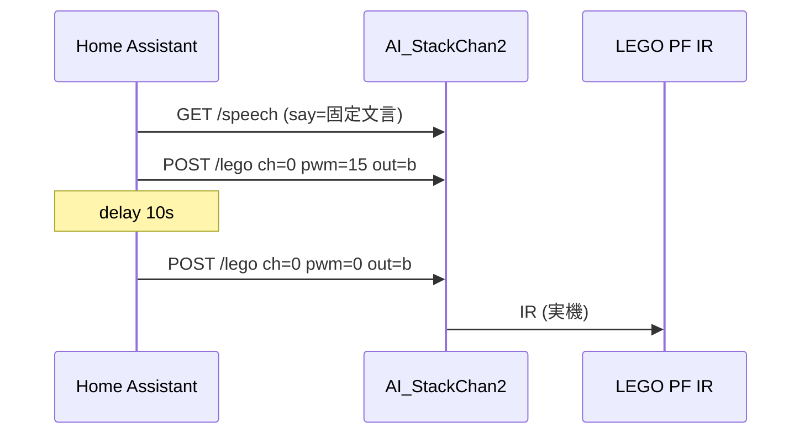

<!-- markdownlint-disable MD025 -->

# 疲労度 0.7 以上でスタックちゃん発話と LEGO PF（10 秒後停止）

## Enhancement Summary

**Deepened on:** 2026-03-23  
**Sections enhanced:** 調査サマリ、提案する解決策、技術的考慮事項、受け入れ基準、依存関係とリスク、実装スケルトン（新設）  
**Research sources:** Home Assistant 公式ドキュメント要約（Context7 `/home-assistant/home-assistant.io`）、コミュニティ議論（遅延と `mode`）、プロジェクト内アーキテクチャ文書

### Key Improvements

1. **自動化 `mode` の選定理由を明文化**: `single` が本シーケンスに適する理由と、`restart` が **10 秒後停止を打ち切る**リスクを記載。
2. **デバウンス**: `numeric_state` に **`for:`** を付ける強化案を公式パターンに沿って追記。
3. **`mode: single` とシーケンス長による暗黙クールダウン**: 全アクション完了まで再入しない挙動を成功指標として明記。
4. **実装スケルトン**: `shell_command` 3 本 + `automation` の並びをコピー用に疑似 YAML で提示（本番値は環境依存）。

### New Considerations Discovered

- Release 0.113 以降、**delay 中に再トリガーされた旧挙動は廃止**され、**`mode` により明示的に制御**する設計が前提になっている。
- **`queued` / `parallel` / `max`** により「最大同時実行数」を制限する拡張パスがある（本件 MVP では不要だが追跡用に記録）。

## ブレインストームとの関係

**参照**: `docs/brainstorms/2026-03-23-ha-fatigue-stackchan-high-threshold-brainstorm.md`（2026-03-23）。

確定済みの要件:

- トリガー: `sensor.kanden_fatigue` が **0.7 以上**
- ① 固定文言の発話（`/speech`）
- ② `POST /lego`：`ch=0`、`pwm=15`、`out=b`
- ③ **10 秒**待機
- ④ `POST /lego`：`ch=0`、`pwm=0`、`out=b`（停止）
- 実装方針: 既存パッケージと同様 **`shell_command` + `automation`（推奨アプローチ A）**

未確定（ブレインストームの Open Questions）: **再トリガー抑制**、**`stack-chan.local` の到達性**。本計画では **MVP の既定**を記載し、運用で上書き可能とする。

## 調査サマリ（ローカル）

| ソース | 内容 |
| ------ | ---- |
| `homeassistant/package_stackchan_fatigue.yaml` | `numeric_state` **`below: 0.7`** と `shell_command` + `curl` の既存パターン |
| `docs/architecture-home-assistant-stackchan.md` | 同一 LAN 直 HTTP、ベース URL 例、`/speech` は GET クエリ。`/lego` は POST のため **アーキテクチャ文面の「GET のみ」表現は不正確** — 必要なら別タスクで修正 |
| `docs/solutions/` | 該当ナレッジなし（ディレクトリ空） |

**外部調査（初版）**: 省略。本深化で **Home Assistant 公式系（Context7 経由）** とコミュニティ要約を追加。

### Research Insights（調査サマリ）

**Best practices:**

- 自動化の **`mode`** は `single`（既定）・`restart`・`queued`・`parallel` から選択。`queued` / `parallel` では **`max`** で待ち行列の上限を制御できる。
- **クールダウン**が目的なら、公式例のとおり **`mode: single` とアクション末尾の `delay`** の組み合わせが定石。本件では **シーケンス全体（発話 + 10 秒 + 停止 POST）が終わるまで再入しない**ため、意図せず **追加のクールダウン**が生じる点を理解しておく。

**References:**

- [Automations YAML（modes）](https://www.home-assistant.io/docs/automation/yaml/)
- [Release 0.113 — Automation modes & delay 挙動](https://www.home-assistant.io/blog/2020/07/01/release-113/)
- [Automation triggers（`for:` による持続条件）](https://www.home-assistant.io/docs/automation/trigger/)

## 概要

Home Assistant に **疲労度しきい値の「上側」** 自動化を追加する。同一オートメーション（または **`script`**）内で **発話 → モーター正転 → 10 秒待機 → モーター停止** を **直列実行**する。



## 問題意識 / 動機

- 疲労データは既に `sensor.kanden_fatigue` で取得できるが、スタックちゃん連携は **0.7 未満での表情リセットのみ**。
- 高疲労時の **声かけ + 物理フィードバック（あめ配布イメージのモーター）** を HA から一連で行いたい。

## 提案する解決策（高レベル）

1. **`homeassistant/package_stackchan_fatigue.yaml` を拡張**（または論理分割のため別 YAML に切り出し — YAGNI のため **同一ファイル追記を既定**）。
2. **`shell_command` を 3 本追加**（発話・LEGO 開始・LEGO 停止）。ベース URL は既存と同様 **`http://stack-chan.local`** を文字列リテラルで保持（環境差はコメントで IP 置換を案内）。
3. **`automation` を 1 本追加**: `numeric_state` **`above: 0.7`**、`action` は `shell_command` → `delay` → `shell_command` の順。**`mode: single`** で同時多重実行を抑制（MVP）。

### Research Insights（提案する解決策）

**モード選定（重要）:**

| `mode` | 本件での意味 | 推奨度 |
| ------ | ------------ | ------ |
| `single`（既定） | 実行中の再トリガーは無視。**delay 含む全ステップ完了まで**次の実行に進まない → **停止 POST まで到達しやすい** | 推奨 |
| `restart` | 再トリガーで**前実行を打ち切り**新規開始。delay 途中で打ち切られると **停止 POST が飛ぶ**可能性 | 非推奨 |
| `queued` | トリガーを順に処理。疲労が高い間に複数回積むと**アメモーターが連打**されうる | 要検討 |
| `parallel` | 同時多実行。モーター制御が重複しうる | 非推奨 |

**デバウンス強化（任意）:** `trigger` に `for: "00:00:05"` 等を付け、**しきい値超過が一定秒継続**したときだけ発火（チラつき抑制）。`numeric_state` の `for:` は公式ドキュメントで他用途と併記されている。

## 技術的考慮事項

### HTTP

- **発話**: `GET /speech`。日本語は **`curl -G` と `--data-urlencode "say=..."`** でクエリを安全に付与。TTS が長い場合は **`--max-time`** を `10` 秒より大きくする（例: `60`）ことを検討。
- **LEGO**: `POST /lego`、`Content-Type: application/x-www-form-urlencoded` 相当で **`-d "ch=0&pwm=15&out=b"`**。成功はデバイス側 **202** だが、`curl` は **2xx** で成功扱いになる。

### Research Insights（HTTP）

**`curl` とシェル:**

- 文字列を **シングルクォートで囲む**か、`--data-urlencode` で **メタ文字をエスケープ**し、`shell_command` 内での意図しない展開を防ぐ。
- **`curl -f`（HTTP 失敗を exit 非ゼロ）** を付けると HA ログで失敗検知しやすいが、**202 を成功として扱えるか**は `curl` バージョン次第のため、導入時は **開発者ツールで一度検証**する。

**部分失敗時の方針（任意）:**

- Home Assistant の新しいアクション形式では、**個別アクションに `continue_on_error`** を付けられる場合がある（バージョン依存）。**発話が失敗しても LEGO 停止まで進める**か、**即中断する**かは運用ポリシーで選択。MVP は **既定（エラーで停止）** でよい。

### 既存自動化との相互作用

- **0.7 未満で Neutral** の自動化と **同時**に動く可能性がある。MVP では **順序は保証しない**が、実害があれば以下を後続イシュー化する:
  - 高疲労シーケンス実行中に 0.7 未満へ落ちた場合の **即 `pwm=0`**（または **`choose`** でキャンセル）
- `/speech` はファームウェア上 **発話前に表情が Happy に固定**される点は仕様として受け入れる（表情指定は別イシュー）。

### エッジケース（SpecFlow 反映）

| 論点 | MVP の扱い | 強化案（任意） |
| ---- | ---------- | -------------- |
| 0.7 前後のちらつき連発 | `mode: single` | `for:` 秒数、`cooldown` 用 `input_number` / `timer` |
| HA 再起動で `delay` 途中 | 第 4 ステップがスキップされ **モーターが回り続けるリスク** | 起動時ワンショットで `pwm=0`、または `persistent_notification` で手動確認 |
| `sensor` が `unknown` | `numeric_state` は通常発火しない | テンプレートトリガで明示ガード |
| `curl` 失敗 | ログのみ | `continue_on_error` と再試行、失敗時も **停止 POST をベストエフォート** |
| Stack Chan ビジー | 未対応 | リトライ 1 回、またはスキップをログ |

### Research Insights（ネットワーク・運用）

- **Container 上の HA** から `*.local` が解決しない場合、`host` ネットワークモード、**IP 直指定**、または LAN 内 **DNS に A レコード**を切るなどが現実的。複数環境では **`!secret stackchan_base_url`** のように **ベース URL だけ**秘密ストレージへ寄せる手もある（YAML 分割とセット）。
- **同一セグメント制限**・ゲスト VLAN からの到達禁止は、既存アーキテクチャ文書の方針を踏襲。

## 実装スケルトン（YAML 参考）

以下は **構造イメージ**であり、インデント・キー名（`action` vs `actions`）は **インストール中の Home Assistant バージョン**に合わせて調整する。新形式では `triggers` / `actions` / `conditions` が推奨される場合がある。

```yaml
# shell_command（例: package 内に追記）
shell_command:
  stackchan_fatigue_speech: >-
    curl -sS -G --max-time 60 "http://stack-chan.local/speech"
    --data-urlencode "say=おつかれさまやなぁ。あめちゃんたべぇ"
  stackchan_lego_forward: >-
    curl -sS --max-time 10 -X POST -d "ch=0&pwm=15&out=b"
    "http://stack-chan.local/lego"
  stackchan_lego_stop: >-
    curl -sS --max-time 10 -X POST -d "ch=0&pwm=0&out=b"
    "http://stack-chan.local/lego"

# automation（例）
automation:
  - id: fatigue_above_stackchan_ames
    alias: 疲労度0.7以上でスタックちゃん発話とLEGO駆動
    mode: single
    trigger:
      - platform: numeric_state
        entity_id: sensor.kanden_fatigue
        above: 0.7
    action:
      - service: shell_command.stackchan_fatigue_speech
      - service: shell_command.stackchan_lego_forward
      - delay:
          seconds: 10
      - service: shell_command.stackchan_lego_stop
```

**注意:** 複数行 `>-` の改行は **実際のシェルではスペースとして連結**される想定。環境によっては **1 行の `shell_command`** の方が安全な場合がある。

## 受け入れ基準

### 機能

- [x] `sensor.kanden_fatigue` が **0.7 以上**になったとき、次が **順に**実行される: ① 指定日本語の発話リクエスト ② `ch=0,pwm=15,out=b` の POST ③ **10 秒**待機 ④ `ch=0,pwm=0,out=b` の POST（YAML 実装済み。**実機での発火確認は運用側**）
- [x] 既存の **0.7 未満で Neutral** の自動化は引き続き動作する（回帰で壊れないこと）
- [x] パッケージ読み込み手順がコメントまたは `docs` で分かる（新規ファイルに分けた場合は `configuration.yaml` の `!include` 例を更新）

### 非機能（MVP）

- [x] 各 `curl` に **`--max-time`** を設定し、無限待ちにしない
- [x] 自動化に **`mode: single`** を付与し、説明コメントで意図を記載
- [x] `stack-chan.local` が使えない環境向けに **IP への置換**をコメントで明記

### 検証（手動）

- [ ] 同一 LAN から `curl` で 3 コマンド相当を手動実行し、スタックちゃん・LEGO が期待どおり動くことを確認してから HA に落とし込む（`docs/lego-pf-http-smoke-test.md` の流れと整合）
- [ ] HA の「開発者ツール → サービス」から各 `shell_command` を単体実行できること

### Research Insights（受け入れ基準の追加提案）

- [ ] **（任意）** シーケンス実行中に **同じ自動化を再トリガーしても無視される**（`mode: single`）ことを Trace / ログで確認
- [ ] **（任意）** `for:` 付きトリガーを採用した場合、**短いスパイクでは発火しない**ことを境界値で確認

## 成功の目安

- デモで疲労スコアを 0.7 以上にしたとき、**決め台詞 + モーター 10 秒 + 停止**が再現性高く行われる。
- 設定が **パッケージ YAML の追記のみ**で完結し、追加コンテナやブリッジが不要。

## 依存関係とリスク

| 項目 | 内容 |
| ---- | ---- |
| 依存 | `sensor.kanden_fatigue`、AI_StackChan2 の **`POST /lego` 対応ビルド**（Core2/CoreS3）、同一 LAN 到達 |
| リスク | 再起動・`curl` 失敗時の **モーター常時駆動**（上記エッジケース） |
| セキュリティ | 既存方針どおり **認証なし HTTP** — VLAN / ファイアウォールで補完 |

### Research Insights（依存関係とリスク）

- **可用性**: スタックちゃんがオフラインのとき、`shell_command` は失敗ログを残すにとどまる。**重要デモ前**は `ping` または **REST の生存確認**を手順化する。
- **セキュリティ**: 平文 HTTP と **LAN 内平文**であることを文書に明記し、**インターネット公開 NAT** を避ける。必要なら **リバースプロキシ + TLS** は別アーキテクチャ変更として扱う（YAGNI）。

## 実装タスク（ファイル単位）

1. [x] **`homeassistant/package_stackchan_fatigue.yaml`**: `shell_command` 3 件追加、`automation` 1 件追加（id / alias 一意）。
2. [x] **（任意）** `docs/architecture-home-assistant-stackchan.md`: 高疲労シーケンスと `/lego` POST の説明を追加。
3. [x] **（任意）** 再トリガー・ホスト名テンプレ化は **Follow-up** に残す（本実装では未対応）。

## Follow-up（深化で明確化したバックログ）

- アーキテクチャ doc の **「GET のみ」記述修正**（`/lego` POST との整合）。
- **`homeassistant.start`**（または同等）での **ベストエフォート `pwm=0`** — 再起動中のモーター残留対策。
- **`for:`** 秒数のチューニングと、**`input_number`** 化による現場調整。

## 参考

- ブレインストーム: `docs/brainstorms/2026-03-23-ha-fatigue-stackchan-high-threshold-brainstorm.md`
- 既存パッケージ: `homeassistant/package_stackchan_fatigue.yaml`
- アーキテクチャ: `docs/architecture-home-assistant-stackchan.md`
- LEGO スモーク手順（別リポジトリ想定の例あり）: `AI_StackChan2/docs/lego-pf-http-smoke-test.md`（ローカルにクローンがある場合）
- Home Assistant: [Automation YAML](https://www.home-assistant.io/docs/automation/yaml/)、[Triggers](https://www.home-assistant.io/docs/automation/trigger/)

## 次のアクション

実装フェーズでは上記タスクに沿って YAML を編集し、手動検証後にコミットする。
