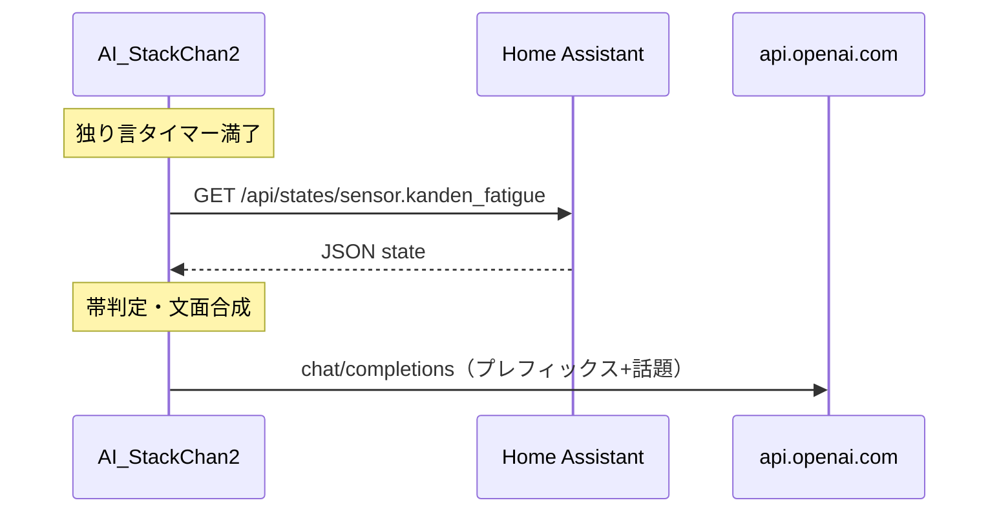

<!-- markdownlint-disable MD025 -->

# 独り言モードで Home Assistant 疲労度を参照した話題制御（スタックちゃん）

## Enhancement Summary

**Deepened on:** 2026-03-23（`/deepen-plan` 相当。引数はブレインストームパスだったため、対象計画は本ファイルに統合）  
**Sections enhanced:** ブレインストーム対応表・概要・提案・技術・受け入れ・リスク・実装タスク・参考リンク  
**Research sources:** Home Assistant REST API 一般仕様（公開ドキュメント・コミュニティ要約）、`AI_StackChan2` `main.cpp` の既存 HTTP/NVS/独り言ループ、`docs/architecture-home-assistant-stackchan.md`

### Key Improvements

1. **HA API の具体化:** 認証ヘッダー形式、想定ステータスコード、状態 JSON の扱い、404 の扱いを受け入れに落とし込んだ。
2. **ESP32 実装の落とし穴:** HTTP と TLS のクライアント差、`HTTPClient` の寿命、ブロッキングとウォッチドッグ、既存 `handle_apikey_set` にある **シリアルへのシークレット全文出力**との整合（新規はマスク必須）を明記した。
3. **数値・状態のエッジケース:** `state` 文字列の小数、`unavailable` 以外の非数値、エンティティ未存在をフォールバック条件に追加した。

### New Considerations Discovered

- 同一リポ内の **`package_stackchan_fatigue.yaml` は 0.7 しきい値**であり、本件の 2 帯定義と一貫している（アーキテクチャ文書に既記載）。
- 独り言ループは `!mp3->isRunning() && speech_text=="" && speech_text_buffer == ""` の **ガード付き**（実装時はこの条件を崩さない）。

## ブレインストームとの関係

**参照:** `docs/brainstorms/2026-03-23-stackchan-monologue-ha-fatigue-brainstorm.md`（2026-03-23）。

**確定済み（ブレインストーム + 本計画での補完）:**

| 項目 | 内容 |
| -------- | -------- |
| 経路 | **アプローチ A:** ファームが **HA REST API** で `sensor.kanden_fatigue` を取得 |
| 認証 | **Long-Lived Access Token** をデバイスに保持（ユーザー許容済み） |
| トーン | **高疲労:** 寄り添い・共感。**低疲労:** 明るい冗談・軽い雑談 |
| 更新 | **独り言タイマー発火のたび**に取得（キャッシュなし） |
| しきい値 | **2 帯**とし、既存 HA 自動化と整合: **`state >= 0.7` → 高疲労**、**`< 0.7` → 低疲労** |
| OpenAI 入力 | **数値はモデルに送らない**。ユーザー文は **`random_words` の要素に、口調用の日本語プレフィックスを前置**する（例: 「（ひとりごと。相手はだいぶ疲れている前提で、短く寄り添う話題を）」／「（ひとりごと。明るく軽い冗談や雑談で）」）。数値は **Serial デバッグのみ**可 |
| フォールバック | HA 取得失敗・状態が数値でない・タイムアウト・401・404 のいずれでも **従来どおり `random_words` のみ**で `exec_chatGPT` を呼ぶ |

**調査サマリ（ローカル）:**

| ソース | 内容 |
| -------- | -------- |
| `../AI_StackChan2/M5Unified_AI_StackChan/src/main.cpp` | 独り言は `random_time` 経過後に `exec_chatGPT(random_words[random(18)])`（約 1278–1285 行付近）。`exec_chatGPT(String text)` は `chat_doc` を組み立て `chatGpt` へ送信（約 459–506 行付近） |
| `homeassistant/mqtt_kanden_fatigue.yaml` | エンティティ例: `sensor.kanden_fatigue` |
| `docs/architecture-home-assistant-stackchan.md` | 同一 LAN・HTTP 運用の注意（Docker 内 mDNS 等）。本件は **スタックちゃん → HA** の向き |
| `docs/solutions/` | 該当ナレッジなし |

**外部調査:** 本件は LAN 内 REST と既知の HA API パターンのため **省略**。実装時は [Home Assistant REST API](https://www.home-assistant.io/developers/rest_api/) の **`GET /api/states/<entity_id>`** を参照する。

### Research Insights（API・認証）

**Best practices:**

- リクエストに **`Authorization: Bearer <long_lived_access_token>`** を付与する（`Bearer` とトークンの間はスペース 1 つ。誤ったヘッダ形式は 401 の典型原因）。
- エンドポイント例: `GET http://<host>:8123/api/states/sensor.kanden_fatigue`（`entity_id` に `/` が含まれない通常のセンサー ID はパスとしてそのまま利用可。将来カスタム ID で予約文字が出る場合は **URL エンコード**を検討）。
- 成功時は **HTTP 200** と JSON オブジェクト。本文の **`state` は文字列型**（数値センサーでも `"0.72"` のように返る）。ファーム側は **`toFloat()` または `atof`** 前に `unavailable` / `unknown` を除外する。

**Edge cases:**

- **404:** エンティティ未存在・タイポ → 本計画のフォールバック（`random_words` のみ）に含める。
- **401 / 403:** トークン失効・権限不足 → フォールバック。設定 UI で再入力を促す文言を README に書く。
- **空の HA 設定:** URL またはトークン未設定時は **HA に一切アクセスせず**フォールバック（不要なタイムアウト待ちを避ける）。

**References:**

- [REST API | Home Assistant Developer Docs](https://www.home-assistant.io/developers/rest_api/)

## 概要

AI_StackChan2（`M5Unified_AI_StackChan`）の **独り言モード**で、`exec_chatGPT` に渡す直前に **Home Assistant から `sensor.kanden_fatigue` の状態を取得**し、**0.7 未満／以上で口調用プレフィックスを切り替え**る。取得に失敗した場合は **従来の `random_words` のみ**とする。**kanden-ai-hackathon 側の HA YAML は必須変更なし**（センサーが既に存在することを前提）。

### Research Insights（フロー・実機）

**Implementation alignment:**

- 現行 `loop()` の独り言は `random_time` 満了かつ **`!mp3->isRunning() && speech_text=="" && speech_text_buffer == ""`** のときのみ `exec_chatGPT(random_words[random(18)])` を呼ぶ。HA 取得は **`exec_chatGPT` の直前**に挿入し、このガードは **変更しない**（再生中ブロックやバッファ競合の回帰を防ぐ）。
- HA 取得は **数秒以内**に完結させる。ESP32 のブロッキング HTTP はアイドルタスクに影響しうるため、`HTTPClient::setTimeout`（および接続タイムアウトが設定可能ならそれも）を **独り言間隔より十分短く**設定する。

**Performance considerations:**

- キャッシュなしでも、数十秒に 1 回の GET は HA・LAN にとって軽微。負荷懸念は **タイムアウト積み上げ**（HA ダウン時）なので、失敗時は早期 return でフォールバックする。

## 問題意識 / 動機

- 疲労度は HA に集約されているが、独り言は **デバイス固定の話題配列**のみ。
- 高疲労時と低疲労時で **口調・話題のニュアンス**を変えたい（ブレインストームで合意済み）。

## 提案する解決策（高レベル）

1. **設定の追加（ファーム）**  
   - HA のベース URL（例: `http://192.168.0.36:8123` 。**末尾スラッシュなし**で統一）  
   - Long-Lived Access Token  
   - オプション: エンティティ ID（既定 `sensor.kanden_fatigue`）  
   - HTTP タイムアウト（例: 3〜5 秒。独り言間隔に対して短く）

2. **設定の入力と NVS 保存**  
   - 既存の `/apikey` フォームと `apikey_set` / NVS パターンを拡張するか、**別ページ `/hass` + `hass_set`** で分離（トークン混在を避けたい場合）。**MVP は既存フォームにフィールド追加**でも可。

3. **`GET /api/states/<entity_id>` の実装**  
   - URL が `https://` の場合は `WiFiClientSecure` + 既存 CA 方針（HA 用ルート CA の埋め込みは運用負荷が高いため、**MVP は HTTP ベース URL を推奨**し、HTTPS は別イシューで扱う旨を README に記載）  
   - `Authorization: Bearer <token>`  
   - 応答 JSON の `state` を文字列として取得し、`toFloat()` 可能なら帯判定。`unavailable` / `unknown`、**HTTP 404** はフォールバック。

4. **独り言ループの変更**  
   - `exec_chatGPT` 呼び出し直前に上記 GET を実行し、成功時は  
     `String userTurn = prefix + random_words[random(18)];`  
     の形で `exec_chatGPT(userTurn)`。失敗時は `exec_chatGPT(random_words[random(18)])`。

5. **ドキュメント**  
   - `docs/architecture-home-assistant-stackchan.md` に **スタックちゃん → HA REST** の片方向と、トークン保管の注意を短く追記（任意・別コミット可）。

### Research Insights（ファームウェアパターン）

**HTTP クライアント:**

- **MVP（HTTP のみ）:** `WiFiClient` + `HTTPClient::begin(client, url)` パターンでよい（既存コードは OpenAI 等で `WiFiClientSecure` が多いが、LAN 直 HTTP では不要）。
- **HTTPS 将来対応:** 既存の `WiFiClientSecure` + ルート CA／証明書ピン留めのいずれかが必要。計画どおり **別イシュー**とし、本リリースでは README に「推奨は LAN 内 HTTP またはリバースプロキシで終端」と明記。

**JSON 解析:**

- 応答は小さな JSON のため **ArduinoJson**（`StaticJsonDocument`、十分小さめの容量で）に `state` のみ抽出でもよい。失敗時はフォールバック。
- **`state` の小数点:** HA REST は通常 **ドット区切り**の数値文字列。ロケール依存のカンマ表記は想定しにくいが、**`toFloat()` が 0 になり帯が誤る**場合に備え、デバッグ時は Serial に数値ではなく **帯ラベル（high/low/fallback）のみ**出すと安全。

**設定ストレージ:**

- NVS 名前空間は既存 `apikey` と分離し **`hass` 等の別 namespace** を推奨（キー衝突回避・将来の erase 単位が明確）。既存 `/apikey` HTML にフィールドを足す場合も、保存先キーは **openai / voicevox と混在させない**。

## 技術的考慮事項

- **セキュリティ:** トークンは NVS に保存。シリアルログに **トークン全文を出さない**。LAN 内限定運用を前提にし、**ゲスト VLAN から HA に届かない**ようネットワーク設計を推奨。
- **TLS:** HA を HTTPS のみで運用している場合、ESP32 側の **証明書検証**が課題。計画の **既定は同一 LAN の HTTP（例: `http://<IP>:8123`）**。
- **パフォーマンス:** 独り言のたびに 1 回 REST。タイマー間隔（数十秒以上）なら負荷は小さい。
- **chatHistory:** `exec_chatGPT` は履歴にプレフィックス付き文字列を積む。履歴が長いとプレフィックスが繰り返し見える可能性あり。**MVP は現状ロジックのまま**、必要なら後続で「独り言専用の短い履歴クリア」を検討。
- **mDNS:** HA URL に `http://homeassistant.local:8123` を使う場合、ESP32 からの名前解決は **環境依存**（別件）。**IP 直指定を推奨**。

### Research Insights（セキュリティ・運用）

**シークレット取り扱い:**

- 現行 `handle_apikey_set` は OpenAI / VOICEVOX / STT キーを **`Serial.println` で全文出力**している。本機能で HA トークンを追加する場合、**新規コード path ではトークンをログに出さない**（先頭数文字 + `…` のマスク、または HTTP ステータスのみ）。既存行の改修は本スコープ外でもよいが、セキュリティレビューでは **差分が悪化しないこと**を推奨。
- Web 設定フォームは **HTTP 平文 POST**（デバイス AP／STA 時のローカル）。運用では **信頼できる端末・SSID のみ**から設定する旨を README に記載。

**ネットワーク:**

- トークンは **LAN 内の HA への認可**に過ぎない。ゲスト VLAN からデバイスや HA に到達できる構成では、取得・設定の両面でリスクが増す。アーキテクチャ文書の **セグメント分離**推奨と整合させる。

## 受け入れ基準

- [ ] 独り言モードが ON でタイマーが満了したとき、**HA 設定が有効**かつセンサーが数値の場合、`sensor.kanden_fatigue >= 0.7` なら **寄り添い用プレフィックス**、`< 0.7` なら **明るい冗談用プレフィックス**が **`exec_chatGPT` に渡るユーザー文に含まれる**（Serial または一時的なデバッグ出力で確認可）。
- [ ] **`state` が `unavailable` / `unknown`、HTTP 失敗、JSON 解析失敗、401、404** のいずれでも **従来どおり `random_words` のみ**で `exec_chatGPT` が呼ばれる（プレフィックスなし）。
- [ ] HA トークン・ベース URL を **Web から設定し NVS に保存**でき、再起動後も有効。
- [ ] OpenAI に送るペイロードに **疲労の数値文字列を含めない**（プレフィックスは定性のみ）。
- [x] `pio run`（対象 env）が成功する。

### Research Insights（検証）

- **手動検証用 curl（開発者 PC）:**  
  `curl -sS -H "Authorization: Bearer <TOKEN>" -H "Content-Type: application/json" "http://<HA_HOST>:8123/api/states/sensor.kanden_fatigue"`  
  で `state` が期待どおりかを先に確認し、ファームのフォールバック切り分けに使う。
- **帯境界:** `0.7` ちょうどは **高疲労（`>= 0.7`）** に含める。テストでは `0.69` / `0.70` の 2 点を用意する。

## 成功指標

- デモで疲労スコアを 0.7 前後で跨いだとき、独り言の **口調の差**が聞き取りレベルで変わる。
- HA を停止した状況でも独り言が **従来どおり動作**する。

## 依存関係とリスク

| リスク | 緩和 |
| -------- | -------- |
| トークン漏えい | 同一 LAN、フォーム送信は HTTPS ではない（デバイスローカル）。運用で VLAN 分離 |
| HA URL 誤設定 | 設定検証用に `GET` の HTTP コードを Serial に表示（本文はマスク） |
| 履歴汚染 | 後続イシューで検討 |
| HA 応答遅延・タイムアウトが長い | タイムアウト上限を設け、**毎回フォールバックで独り言は継続**（ユーザー体感の「沈黙」を避ける） |
| ウォッチドッグ／メインループ停滞 | 長いブロッキングを避け、HTTP は非同期化が難しければ **短いタイムアウト**に限定 |

## 実装タスク（チェックリスト）

- [x] `main.cpp`: HA 設定用グローバル変数 + **NVS は `apikey` とは別 namespace**（例: `hass`）で読み書き
- [x] `main.cpp` または小さな `.cpp`: 帯判定用ヘルパ（GET `/api/states/<entity>`、タイムアウト、非 200 / 非数値 / `unavailable` / `unknown` は **フォールバック指示**を返す）
- [x] `main.cpp`: 独り言ブロックで上記を呼び、プレフィックス合成して `exec_chatGPT` へ（**既存の mp3 / speech_text ガードは維持**）
- [x] Web UI: URL / token / entity_id（任意）入力。**POST ハンドラで HA トークンを Serial に全文出さない**
- [x] README または `docs/`（AI_StackChan2 側）: 設定手順・HTTP 推奨・[プロファイルからの長期トークン発行](https://www.home-assistant.io/docs/authentication/#your-profile)（公式）へのリンク
- [x] （任意）`docs/architecture-home-assistant-stackchan.md` へ一方通行 REST の追記

## 仕様フロー上の注意（簡易 SpecFlow）

- **連続タイマー:** 取得失敗が続いても毎回フォールバックで独り言は継続する。
- **MP3 再生中:** 既存どおり独り言の `exec_chatGPT` 条件（`!mp3->isRunning()` 等）を壊さない。
- **chat と独り言の同時性:** 既存の `speech_text` バッファ競合ロジックを変更しない。

## 参考リンク

- [Home Assistant REST API](https://www.home-assistant.io/developers/rest_api/)
- [Home Assistant Authentication — Your profile（長期トークン）](https://www.home-assistant.io/docs/authentication/#your-profile)
- ブレインストーム: `docs/brainstorms/2026-03-23-stackchan-monologue-ha-fatigue-brainstorm.md`
- 実装リポジトリ: `AI_StackChan2/M5Unified_AI_StackChan/`（ワークスペース外の隣接リポジトリを想定）

## 次のアクション

実装は **AI_StackChan2** リポジトリで行い、kanden 側はドキュメント追記があれば別 PR でよい。準備ができたら実装ブランチで上記チェックリストを潰し、実機で HA オン／オフの両方を確認する。
